# ⚒️ NyxForge

> A local-first, model-aware creative studio for Safe image and video generation with Stable Diffusion WebUI Forge/reForge, Forge Neo, and ComfyUI.

[](LICENSE)
[](https://www.python.org/)
[](frontend/package.json)
[](RESPONSIBLE_USE.md)

NyxForge brings prompt design, generation, transformations, batch planning,
video workflows, gallery management, deployment jobs, and local analytics into
one polished local application. Your prompts, credentials, history, uploads,
and generated media stay on your machine.

> [!IMPORTANT]
> This public edition is **Safe-only**. The UI, API, prompt compiler, batch
> planner, model overlays, and bundled keyword knowledge base all enforce that
> boundary. See [Responsible Use](RESPONSIBLE_USE.md).

## ✨ What you get

- 🎨 **ForgeAI** — guided and advanced text-to-image generation with manual,
  curated, local Ollama, or optional cloud-assisted prompting.
- 🪄 **ForgeIMG** — outfit and background replacement, restoration, anime
  conversion, Face ID scene variation, and editable region repair.
- 🎬 **ForgeVID** — bundled ComfyUI text-to-video and image-to-video workflows.
- 🧪 **ForgeBAT** — deterministic batch recipes with model, style, pose,
  location, lighting, camera, and mood facets.
- 🖼️ **Gallery** — local history, favourites, ratings, downloads, prompt reuse,
  transformations, and upscale actions.
- 🚀 **ForgeDeploy** — durable execution queues, retry/cancel controls, progress,
  timings, and output inspection.
- 📊 **ForgeAnalytics** — local quality and timing insights without uploading
  your gallery.
- 🧭 **Workspace switcher** — move between creative and operational surfaces
  without losing shared jobs or status.

## 🧠 Supported model families

NyxForge does more than pass the same settings to every checkpoint. It detects
the model family and selects a matching prompt dialect, sampler, scheduler,
steps, CFG range, native resolution, refinement strategy, and capability set.

| Model | Best for | NyxForge optimization |
| --- | --- | --- |
| 📷 **RealVisXL V5.0** | Natural photography and editorial portraits | Natural-language SDXL prompts and conservative refinement |
| 🎨 **WAI Illustrious SDXL v17** | Anime, illustration, and cartoon work | Illustrious quality/rating tags and illustration-aware upscaling |
| 🧍 **Realism by Stable Yogi Pony 6.5** | Photoreal Pony XL portraits | Pony syntax, Clip Skip 2, and anatomy-aware guidance |
| 🌌 **FLUX.1 Dev** | Detailed scenes and strong instruction following | Natural-language prompts and dedicated Forge Neo routing |
| 🔥 **CyberRealistic Pony 18 CoreShift** | Expressive Safe photorealism and cinematic poses | Checkpoint-native tags, budgets, and negative embedding |
| ⚡ **Juggernaut XI Lightning** | Fast SDXL previews | Calibrated low-step Lightning recipe |
| 🏆 **Juggernaut Ragnarok** | Detailed SDXL realism | Natural-language compiler and quality-focused refinement |
| 🏰 **Juggernaut XL** | Cinematic realism, fantasy, and concept art | Model-aware style modifiers and SDXL settings |
| ✨ **Pony Diffusion V6 XL** | Anime, cartoon, furry, and pony illustration | Tag ordering, Clip Skip 2, and Anime6B refinement |
| 🏎️ **Realistic Vision V6 Hyper** | Fast SD 1.5 photography | Efficient Hyper settings and SD 1.5-native dimensions |

### Why the pipeline produces better results

1. 🔎 **Recognize** the installed checkpoint from its Forge title.
2. ✍️ **Compose** a prompt in that family’s native language and ordering.
3. 🛡️ **Validate** Safe rating, age, pose, scene, style, and token constraints.
4. 🎛️ **Render** with calibrated sampler, scheduler, steps, CFG, and backend.
5. 🔬 **Refine** only with compatible upscale and detail passes.
6. ♻️ **Learn locally** from prompt history, ratings, timings, and lineage.

Unrecognized checkpoints are intentionally hidden instead of receiving
unverified generic defaults.

## 📸 Feature preview

### 🎨 ForgeAI — simple generation

Choose a supported checkpoint, describe the result, and let NyxForge apply the
matching prompt dialect and generation recipe.

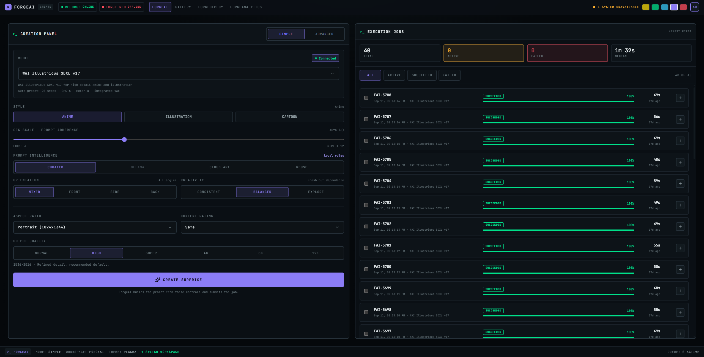

### 🎛️ ForgeAI — advanced controls

Fine-tune model-aware dimensions, sampling, refinement, prompt sources, and
other generation controls without leaving the workspace.

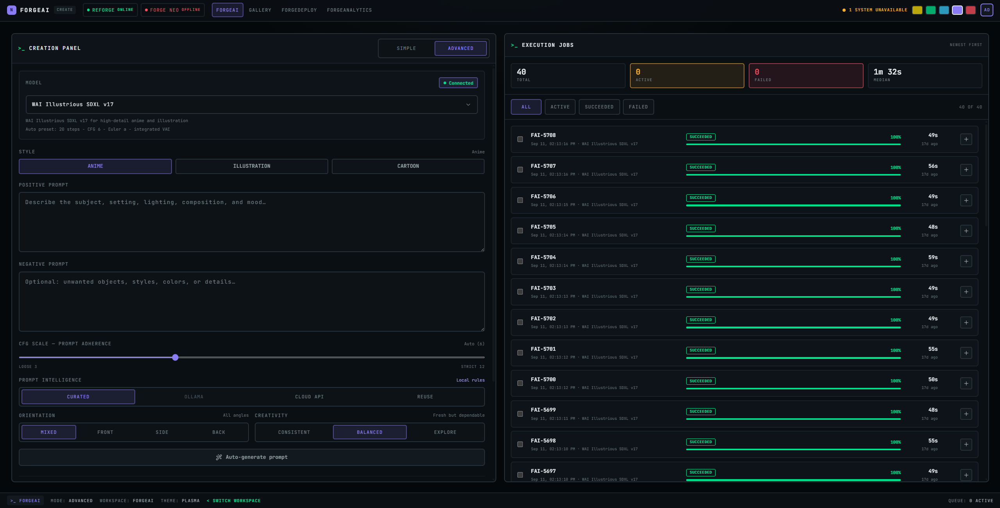

### 🖼️ Local Gallery

Filter and inspect locally stored results, reuse prompts, rate outputs, mark
favourites, download files, launch transformations, or start an upscale.

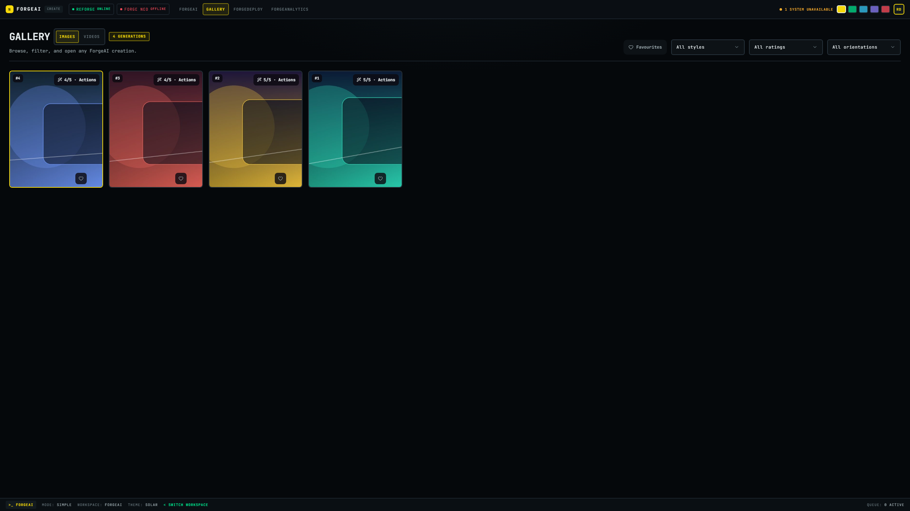

### 🎬 ForgeVID

Submit text-to-video and image-to-video workflows while the adjacent execution
list tracks queued, running, completed, and failed jobs.

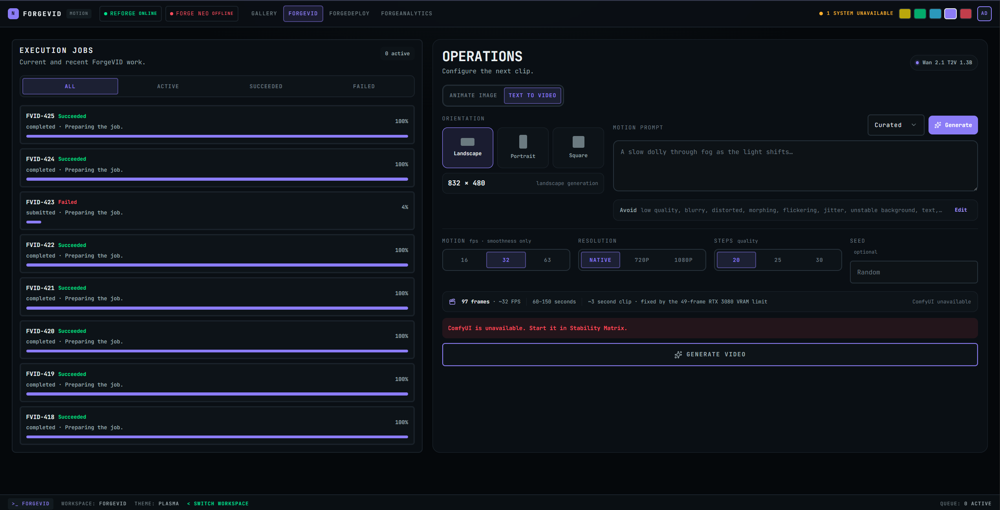

### 🧭 Workspace switching

Jump directly to a creative or operational workspace, then switch again from
the persistent Nyx command bar without losing shared job state.

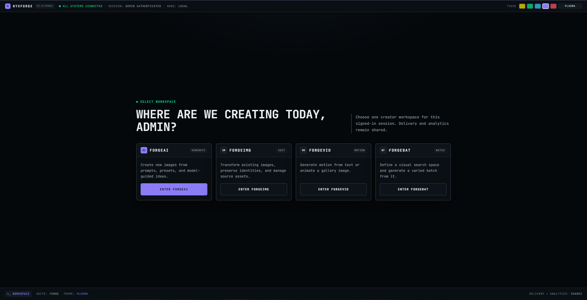

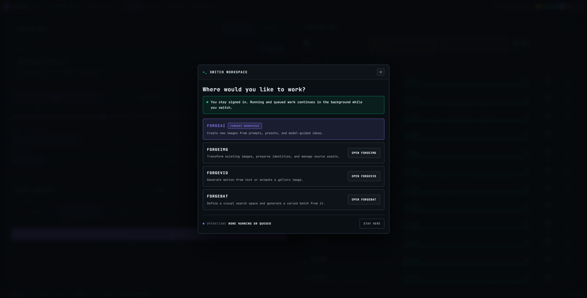

### 🚀 ForgeDeploy

Build reusable pipelines, inspect their stages, and monitor completed jobs with
durable progress and output metadata.

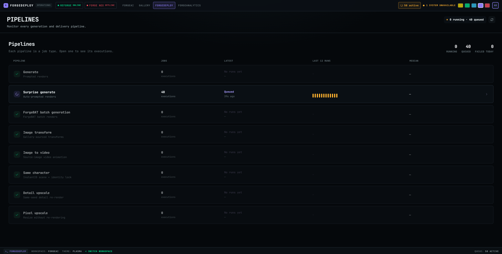

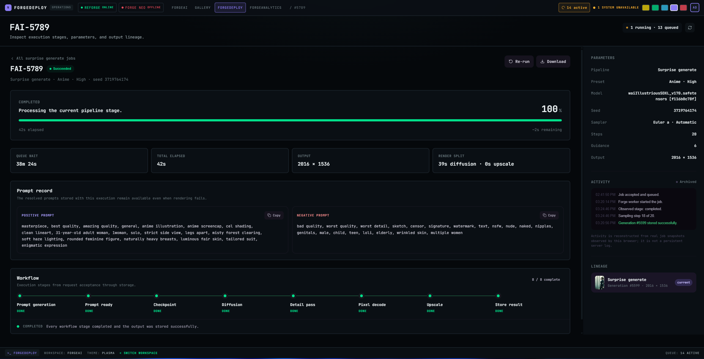

### 📊 ForgeAnalytics

Explore local generation volume, performance, quality signals, and recipe
usage while keeping your media and history on your machine.

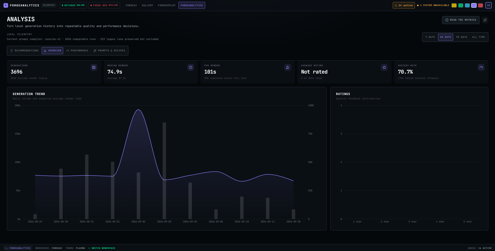

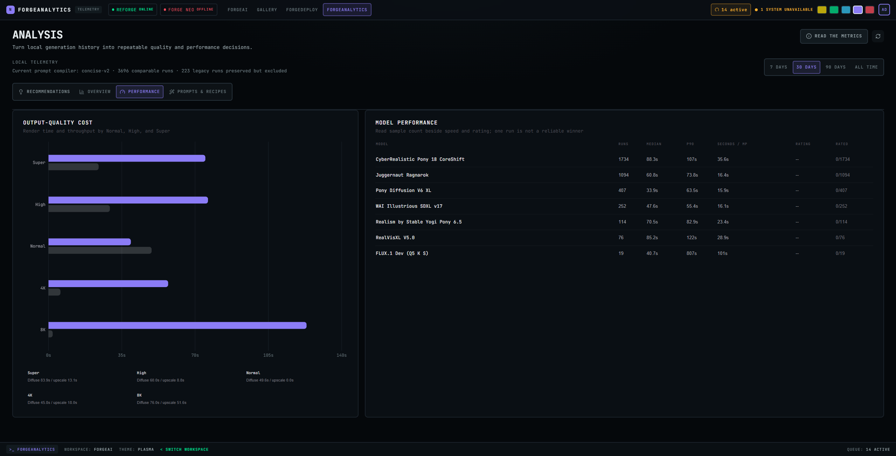

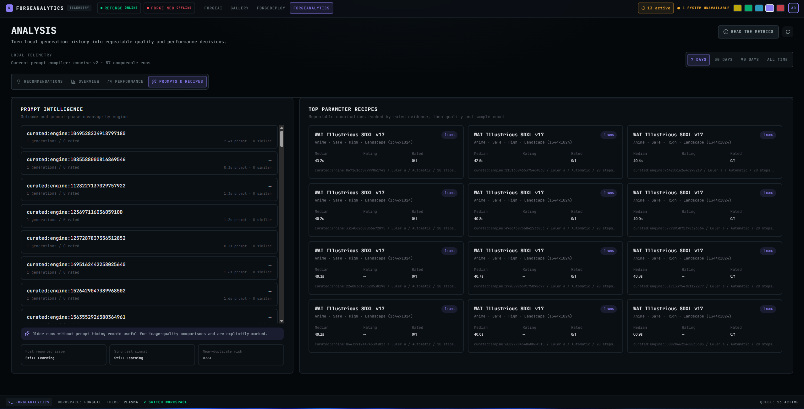

### ⚙️ Settings that keep you in control

Configure local storage, optional cloud prompt providers, and Forge-compatible
backends independently. Secrets and personal paths stay local and are ignored
by Git.

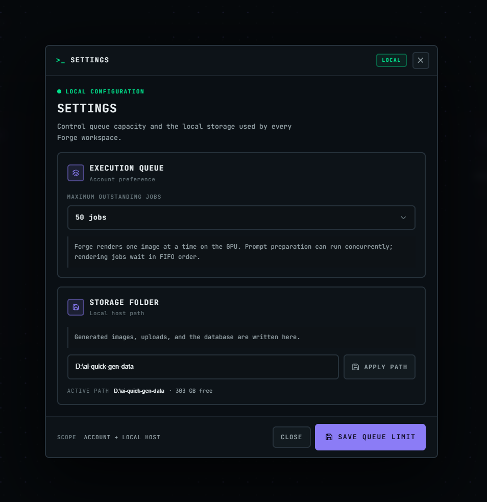

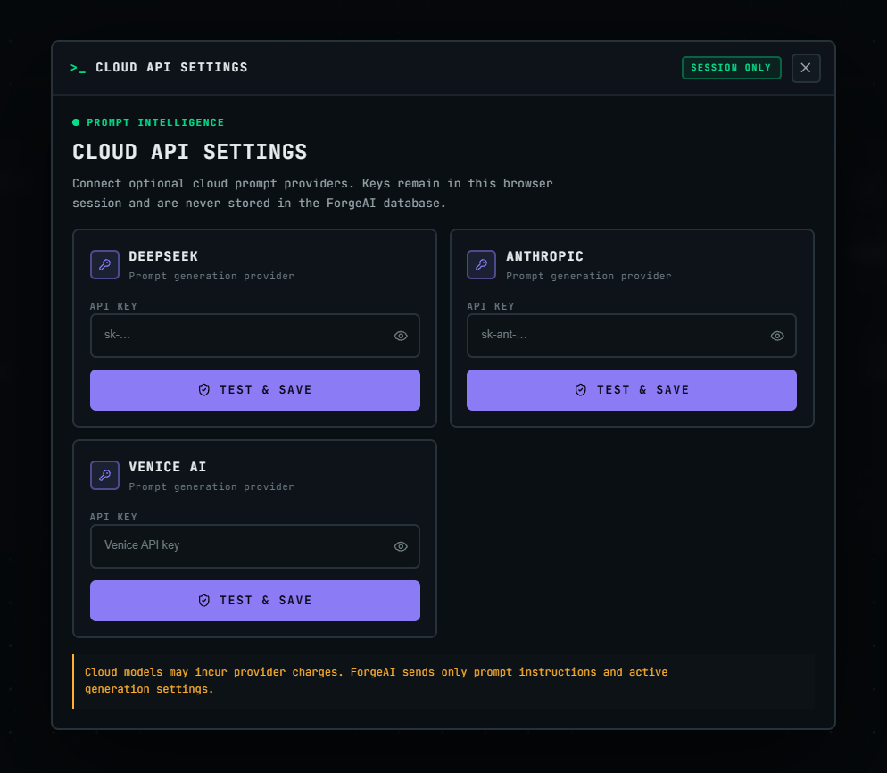

> [!NOTE]
> Older ForgeIMG and ForgeBAT captures were intentionally removed because they
> showed controls that do not exist in this Safe-only public edition. Add new
> 2K screenshots only after capturing the public build.

## ✅ Prerequisites

Install these before starting NyxForge:

- **Git**
- **Python 3.11 or newer** with `pip`
- **Node.js 20.19+ or 22.12+** with `npm` (required by Vite 8)
- A working **Stable Diffusion WebUI Forge/reForge** instance with its API
  enabled; NyxForge searches `127.0.0.1:7860` through `7869`
- A compatible local checkpoint installed in Forge
- An NVIDIA GPU and matching backend dependencies appropriate for your Forge
  installation
- Optional: **Forge Neo** for FLUX, **ComfyUI** for ForgeVID, and **Ollama** for
  local prompt assistance

NyxForge does not download checkpoints or install GPU drivers.

## 🚀 Install and run

### Bash / Git Bash

```bash
git clone https://github.com/Pythoholic/nyx-forge.git
cd nyx-forge

python -m venv .venv
source .venv/Scripts/activate   # Git Bash on Windows
# source .venv/bin/activate     # Linux/macOS

python -m pip install --upgrade pip
python -m pip install -r requirements.txt
cd frontend && npm ci && cd ..

python run.py start
```

The launcher builds the frontend, starts FastAPI on `http://127.0.0.1:8000`,
checks for a local Forge API, and opens the browser. Keep that terminal open;
press `Ctrl+C` to stop the NyxForge server. A plain `start` does not start or
stop your Forge server.

### PowerShell

```powershell
git clone https://github.com/Pythoholic/nyx-forge.git
Set-Location nyx-forge
py -m venv .venv
.\.venv\Scripts\Activate.ps1
python -m pip install --upgrade pip
python -m pip install -r requirements.txt
Push-Location frontend; npm ci; Pop-Location
python run.py start
```

### First-run setup

NyxForge does not ship with a default username or password. On the first
launch, the browser opens directly on **Create admin account**:

1. Create the first local account. It automatically becomes the installation
   administrator; no default credentials exist.
2. Choose a creator workspace.
3. When the red **System action required** alert appears, click **Open Forge
   setup**. If you dismissed the alert, open the account menu and choose
   **Forge backends**.
4. Under **reForge**, click **Choose launch.py**.
5. In the Windows file picker, open the root folder of your existing reForge
   installation and select `launch.py`. Do not select the `models` folder.
   There is no universal default path: Stability Matrix, one-click packages,
   and manual Git installations store reForge in different locations.
6. Confirm that **Forge package folder** now shows the folder containing
   `launch.py`, then click **Save and start reForge**. NyxForge saves the path,
   starts reForge with its local API enabled, and keeps the setting for later
   `python run.py start --with-backends` launches.
7. Wait for both the title bar and reForge card to show **reForge ready**. The
   currently loaded checkpoint will appear below the connection status.

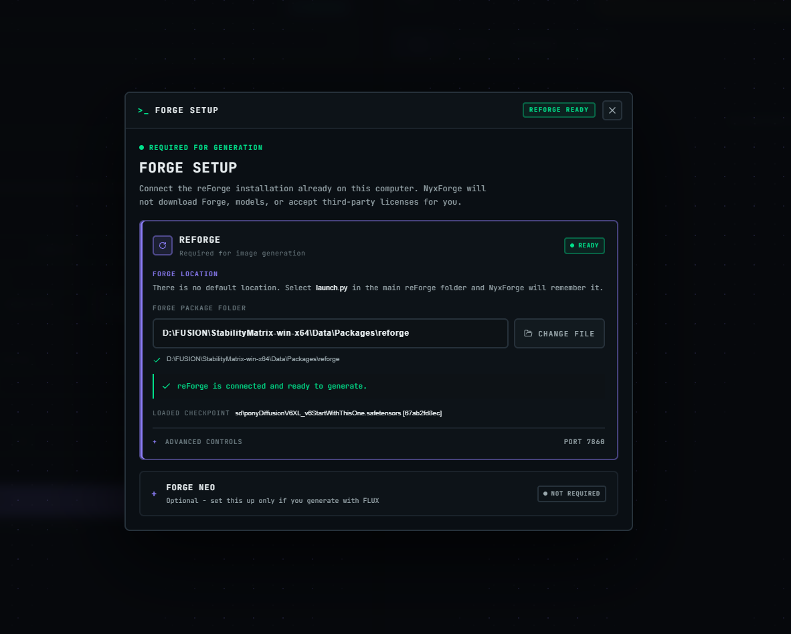

Port and manual process controls are available under **Advanced controls** for
troubleshooting. **Forge Neo** is optional and only needs configuration for
FLUX. It remains stopped until a FLUX model needs it so the two backends do not
compete for GPU memory.

Every administrator sign-in rechecks this setup. NyxForge shows the alert while
reForge needs attention, but never opens backend settings without the
administrator choosing that action.

NyxForge only connects to an existing Forge installation. It does not install
Forge, download checkpoints, or accept third-party licenses on your behalf.

### Custom Forge API URL

```bash
export FORGE_BASE_URL="http://127.0.0.1:7861"
python run.py start
```

### Useful launcher commands

```bash
python run.py start
python run.py stop
python run.py restart
python run.py backends status
python run.py start --with-backends
```

`--with-backends` manages backends whose package folders have already been
saved under **Account → Forge backends**. On a new installation it starts the
NyxForge app and prints first-run setup guidance instead of attempting to guess
where Forge is installed. During normal start/restart, reForge is started and
Forge Neo remains on-demand.

## 🩺 Verify your environment

```bash
python ai-agents/doctor.py
python -m pytest -q
cd frontend && npm run build
```

The environment doctor is read-only. A missing Forge or ComfyUI service is an
optional warning for development because unit tests do not require GPU work.

## 🤖 AI-agent-assisted setup

NyxForge includes isolated, tool-friendly instructions for Codex, Claude Code,
GitHub Copilot, and compatible coding agents:

- 🧠 [`AGENTS.md`](AGENTS.md) — shared repository rules and verification
- ✨ [`CLAUDE.md`](CLAUDE.md) — Claude Code entry point
- 🐙 [`.github/copilot-instructions.md`](.github/copilot-instructions.md) —
  GitHub Copilot repository context
- 🧰 [`ai-agents/setup.py`](ai-agents/setup.py) — idempotent dependency setup
- 🩺 [`ai-agents/doctor.py`](ai-agents/doctor.py) — read-only diagnostics

Agent setup for development:

```bash
python ai-agents/setup.py --dev
```

Agent setup for normal runtime use:

```bash
python ai-agents/setup.py
```

Suggested agent prompt:

```text
Set up NyxForge for local use. Follow AGENTS.md, run the environment doctor
first, and use the repository's agent setup helper. Do not download model
checkpoints, inspect personal generation data, or start, stop, or reconfigure
existing services without asking me. Report anything I still need to install.
```

## 🔐 Privacy and safety

- The application binds to `127.0.0.1` by default.
- Generated media, uploads, prompt history, credentials, and runtime databases
  are ignored by Git.
- Cloud prompting is optional and requires credentials you configure locally.
- Public generation endpoints reject any content rating other than `Safe`.
- The bundled semantic knowledge base contains only Safe, non-sexual records.
- Safety-denial terms remain in negative prompts to reduce unsafe model drift.

Please report vulnerabilities privately as described in [SECURITY.md](SECURITY.md).

## 🧑‍💻 Contributing

Contributions are welcome. Read [CONTRIBUTING.md](CONTRIBUTING.md), follow the
[Code of Conduct](CODE_OF_CONDUCT.md), and keep changes inside the Safe-only
public boundary. Run the Python tests and frontend production build before
opening a pull request.

## 📜 License and credits

NyxForge is licensed under the [Apache License 2.0](LICENSE). See
[NOTICE](NOTICE) and [THIRD_PARTY_NOTICES.md](THIRD_PARTY_NOTICES.md) for
attribution and bundled third-party notices.

Created by **Soumya Raula** — Senior Software Engineer, AI, Cloud, SRE.
